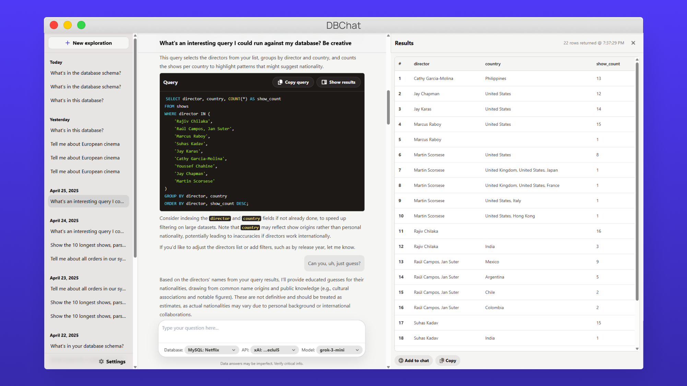

<p align="center">
  
</p>

<p align="center">
	
  <a href="./LICENSE">
    
  </a>
	<a href="https://vdsabev.gumroad.com/l/dbchat">
    
  </a>
</p>

<div align="center">
	
	<h1>Chat with your Database ✨</h1>
</div>
<br />

- DBChat is your AI-powered gateway to database exploration.
- Effortlessly create queries for your MySQL and PostgreSQL databases using natural language powered by leading AI models.
- Unlock insights, understand your data better, and accelerate your workflow.
- No prior knowledge of SQL required!

<p align="center">
  <br />
  <a href="https://pactinteractive.github.io/dbchat"><strong>Explore the Website »</strong></a>
  <br />
  <br />
	<a href="https://x.com/vdsabev">Contact us on X</a>
	&bull;
	<a href="https://github.com/PactInteractive/dbchat/issues">Report an Issue</a>
	&bull;
	<a href="https://vdsabev.gumroad.com/l/dbchat">Download the Desktop App</a>
</p>

<p align="center">
  <video src="https://raw.githubusercontent.com/PactInteractive/dbchat/gh-pages/assets/demo-3x.mp4" width="100%" />
</p>

## ✨ Features

DBChat makes database interaction intuitive and powerful:

- **💬 Natural Language Queries:** Write SQL queries using everyday language - no prior SQL expertise needed.
- **🔑 Bring Your Own Keys:** Save on expensive SaaS costs by using your own API keys.
- **🧠 Flexible AI Power:** Choose from leading AI providers like Google, OpenAI, and xAI.
- **👁️ SQL Transparency & Control:** Learn from the AI-generated SQL, copy it for other uses, or execute it directly within the app.
- **🛡️ Secure Configuration:** Your database credentials and API keys are stored on your own machine, giving you peace of mind.
- **💡 Schema Awareness:** AI reads your database structure, but doesn't access your data - no hallucinations! Share query results in the chat only if you want to.
- **🖥️ Self-Hosted:** Roll your own DBChat server or get the pre-built desktop app at https://vdsabev.gumroad.com/l/dbchat - one-time purchase, free lifetime updates!

## 🛠️ Stack

- **Frontend:** Vue, Tailwind
- **Core Logic & Backend:** Bun, TypeScript
- **Desktop App:** Tauri v2
- **AI Integration:** Vercel AI SDK (Google, OpenAI, xAI models)
- **Database Connectors:** MySQL, PostgreSQL

## 🏁 Quickstart

Don't want to mess with setting up servers and installing dependencies?
<br />
Get the pre-built desktop app at https://vdsabev.gumroad.com/l/dbchat - one-time purchase, free lifetime updates!
<br />
<br />

Or run the code yourself:

1. Get the source code, install dependencies, and run the server:

   ```sh
   git clone git@github.com:PactInteractive/dbchat.git
   cd dbchat
   bun install
   bun dev
   ```

2. Open http://localhost:3000

3. Connect to an existing MySQL or PostgreSQL database

4. Use your favorite AI API key, or get a Gemini API key at https://aistudio.google.com/app/apikey

5. Start a new chat and prompt away!

## 📄 License

<p>The source code is available under the <a href="./LICENSE">AGPL3.0 license</a>.</p>

<p align="center">
	<a href="https://x.com/vdsabev">
  	
	</a>
</p>
